<div align="center">


# 🏥 DHG Vaccine Fee Pricing Dashboard

### Enterprise Healthcare Platform · React 18 · AI-Powered · Voice Enabled
### `dhg-rateauto-ui-frontend` — Dummy Health Group

<br/>

[](https://react.dev)
[](https://nodejs.org)
[](https://github.com/bikram-singh/dhg-rateauto-ui-frontend)
[](https://github.com/bikram-singh/dhg-rateauto-ui-frontend)
[](https://nginx.org)
[](https://docker.com)
[](https://cloud.google.com/kubernetes-engine)
[](https://anthropic.com)
[](https://jwt.io)
[](https://web.dev/progressive-web-apps)
[](https://cloud.google.com/iam/docs/workload-identity-federation)

<br/>

> *A production-grade vaccine pricing intelligence platform — 20 functional pages, real-time KPIs, AI voice advisor, global search, JWT authentication, deep ocean teal theme, and full data export. Deployed on GKE Autopilot with zero-downtime rolling updates.*

<br/>

**🌐 Live Application:** [`https://dev.gcpcloudhub.shop/vaccinefee-ui`](https://dev.gcpcloudhub.shop/vaccinefee-ui) &nbsp;|&nbsp;
**📖 API Docs:** [`https://dev.gcpcloudhub.shop/vaccinefee/api/docs`](https://dev.gcpcloudhub.shop/vaccinefee/api/docs)

</div>

---

## 📋 Table of Contents

- [Overview](#-overview)
- [Platform at a Glance](#-platform-at-a-glance)
- [UI Gallery](#-ui-gallery)
- [Tech Stack](#-tech-stack)
- [All 20 Pages](#-all-20-pages)
- [Key Features](#-key-features)
- [Project Structure](#-project-structure)
- [Theme System](#-theme-system)
- [Authentication & RBAC](#-authentication--rbac)
- [Global Search](#-global-search)
- [AI Vaccine Advisor](#-ai-vaccine-advisor)
- [API Integration](#-api-integration)
- [Local Development](#-local-development)
- [Docker](#-docker)
- [Kubernetes](#-kubernetes)
- [CI/CD Pipeline](#-cicd-pipeline)
- [ESLint & Code Quality](#-eslint--code-quality)
- [Environment Variables](#-environment-variables)
- [Security](#-security)
- [Adding Your Own UI Gallery Images](#-adding-your-own-ui-gallery-images)
- [Related Repositories](#-related-repositories)

---

## 🌐 Overview

The **DHG Vaccine Fee Pricing Dashboard** is a full-stack enterprise healthcare web application built for the **Dummy Health Group (DHG)**. It provides real-time vaccine pricing intelligence across **~150 hospitals** in 15+ countries — helping healthcare administrators, procurement teams, and clinicians make informed vaccine purchasing decisions.

The frontend is a **React 18 Single Page Application** served by **nginx 1.25** on port 8080, containerised with Docker (multi-stage build), and deployed on **GKE Autopilot** via a fully automated GitHub Actions CI/CD pipeline authenticated through **Workload Identity Federation** — no JSON keys stored anywhere.

### 🩺 What Problem It Solves

| Problem | Solution |
|---|---|
| No visibility into vaccine prices across hospitals | Real-time pricing table with 5,000+ records |
| Can't compare hospital offerings side-by-side | Compare page with radar chart + metric table |
| Vaccine availability unknown | Stock status badges + bell alerts for low stock |
| No AI guidance on vaccines | Claude-powered voice + chat advisor |
| Paper-based vaccination records | Digital vaccine card with print support |
| Manual appointment booking | 5-step digital booking wizard |
| No historical price data | 10-month price history with trend charts |

---

## 📊 Platform at a Glance

| Metric | Value |
|---|---|
| 📄 **Total Pages** | 20 functional pages |
| 🏥 **Hospitals** | ~150 real hospitals (India, USA, Europe, Asia, Middle East) |
| 💉 **Vaccines** | 40 real vaccines with actual manufacturers |
| 💰 **Pricing Records** | 5,000+ records seeded from real market data |
| 🌍 **Countries** | 15+ (India, USA, UK, Germany, France, Singapore, UAE, Australia, South Korea, Canada, Thailand) |
| 🏙️ **Haryana Cities** | 8 district hospitals (Rewari, Rohtak, Jhajjar, Faridabad, Narnaul, Ambala, Karnal, Yamunanagar) |
| 🤖 **AI Model** | Claude Sonnet (`claude-sonnet-4-20250514`) |
| ⚡ **Auto-refresh** | Live KPIs every 30 seconds |
| 🎨 **Theme** | Deep Ocean Teal — dark + light mode |
| 📱 **PWA** | Installable on Android + iOS |
| 🔄 **Deploy** | Zero-downtime rolling update on GKE |
| 📦 **Docker** | Multi-stage — `node:20-alpine` → `nginx:1.25-alpine` |
| 🔐 **Auth** | JWT (HS256, 8-hour expiry) + Role-Based Access Control |

---

## 🖼️ UI Gallery

> 📌 **Note:** Screenshots are stored in `docs/gallery/`. See [Adding Your Own UI Gallery Images](#-adding-your-own-ui-gallery-images) at the end of this README for step-by-step instructions.

### 🏠 Dashboard — Live KPI & Price Chart
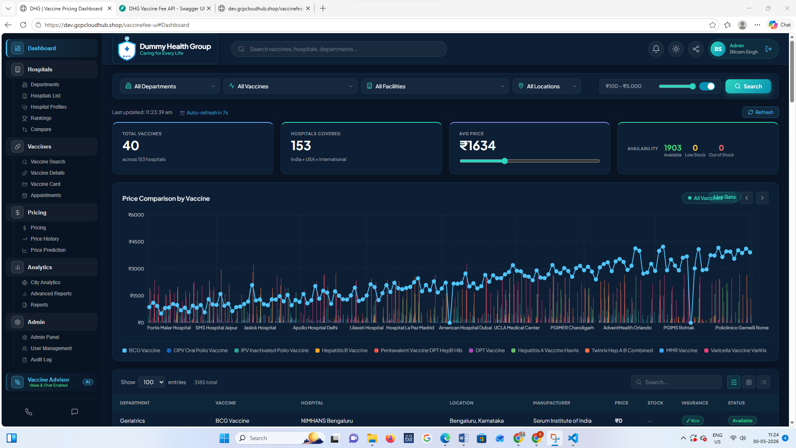

---

### 🏥 Hospitals List
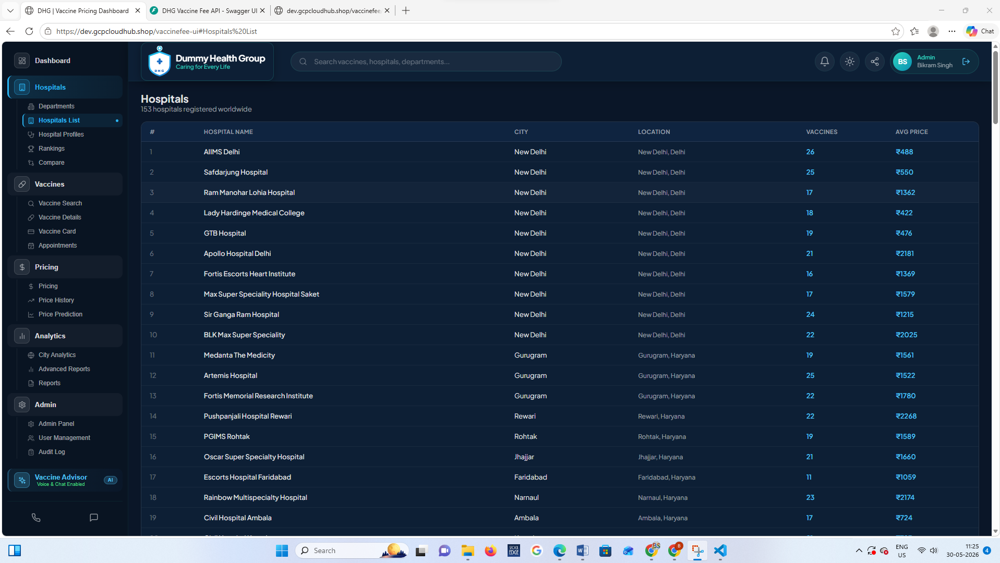

---

### 🏥 Hospital Profiles — Detailed View
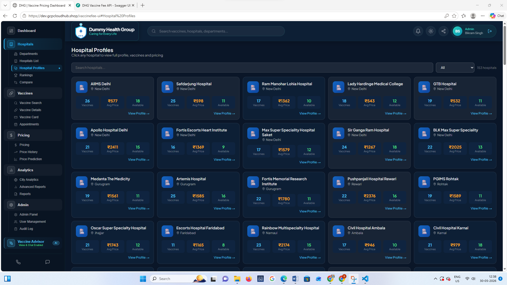

---

### 💉 Vaccine Search
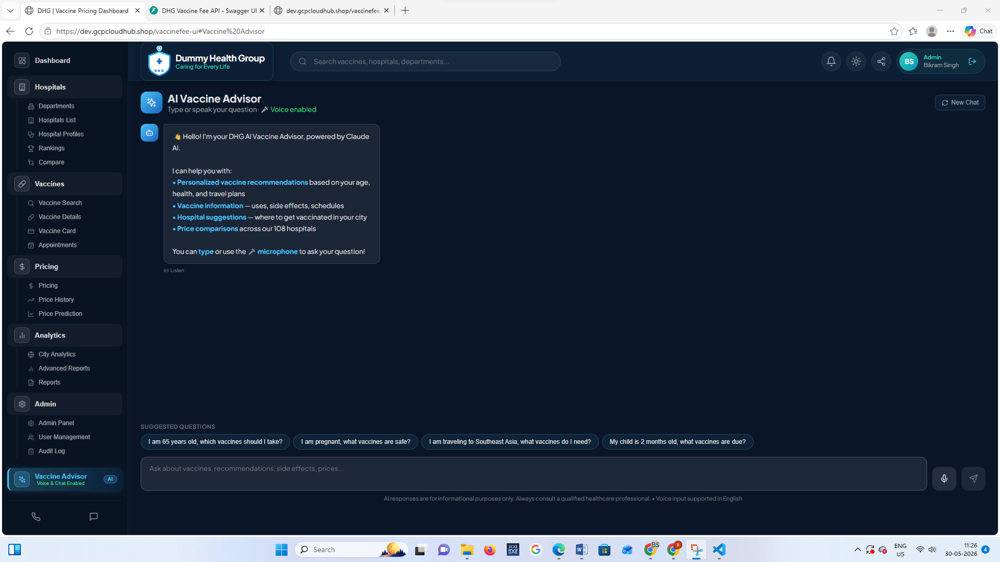

---

### 💰 Pricing Table
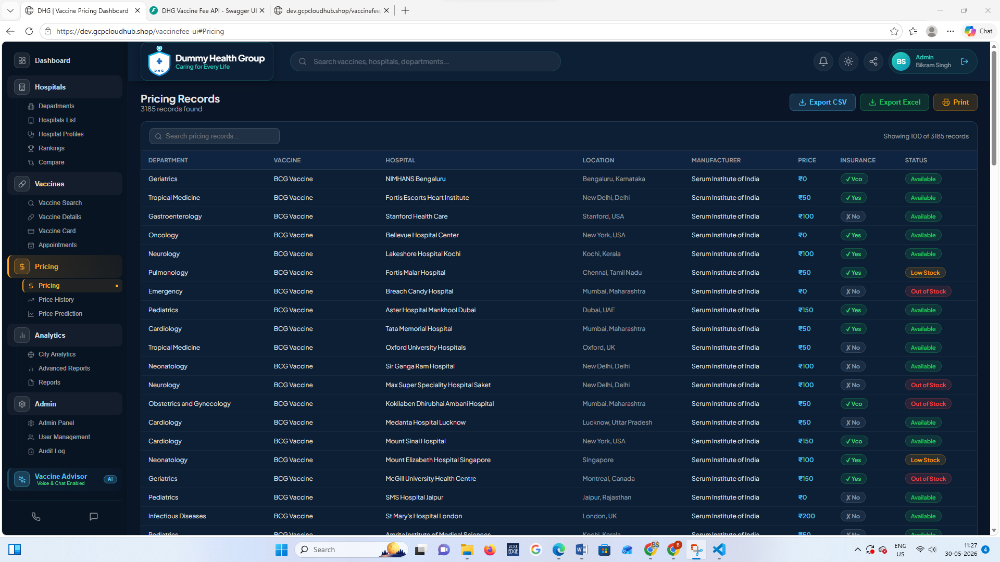

---

### 📈 Price History — Trend Charts
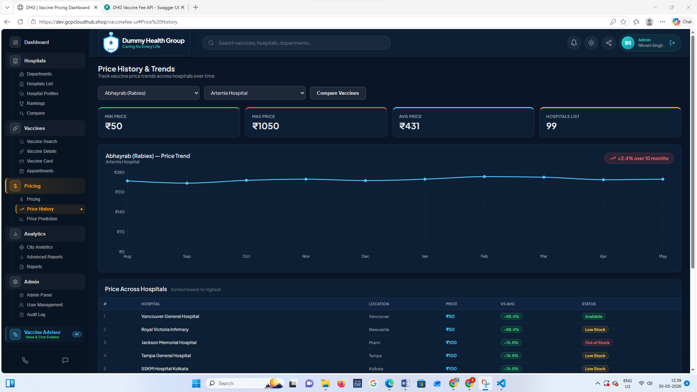

---

### 🤖 Vaccine Advisor — AI + Voice
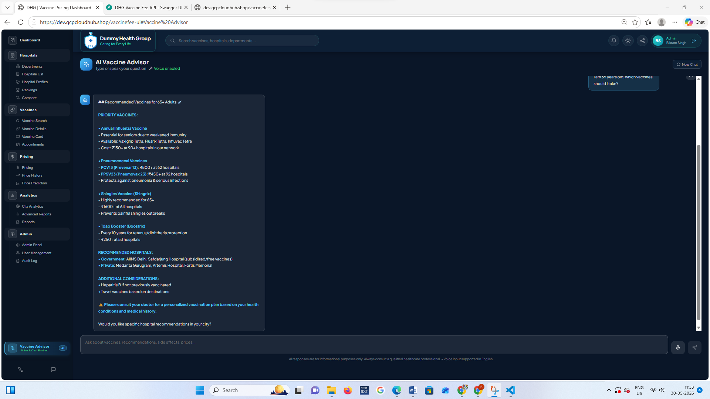

---

### 📅 Appointments — 5-Step Wizard
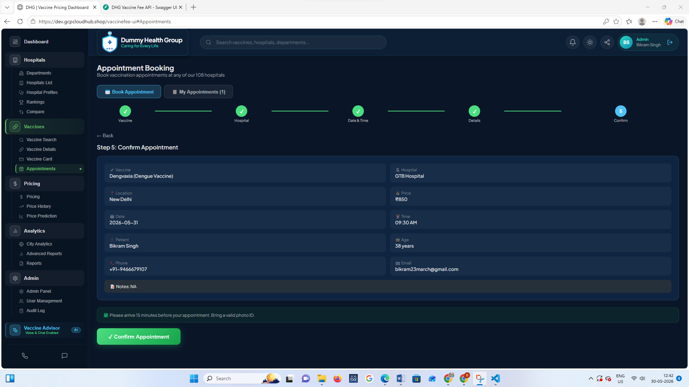

---

### 🌍 City Analytics
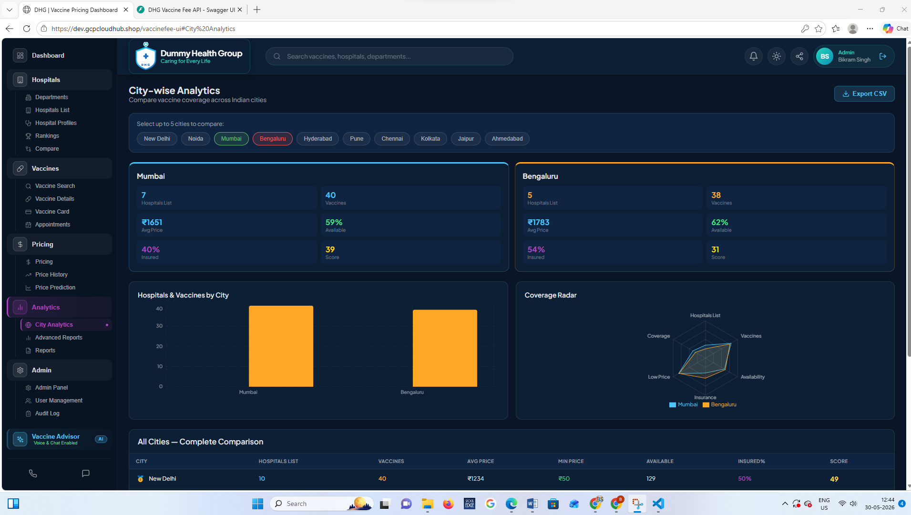

---

### ☀️ Light Mode — Dashboard
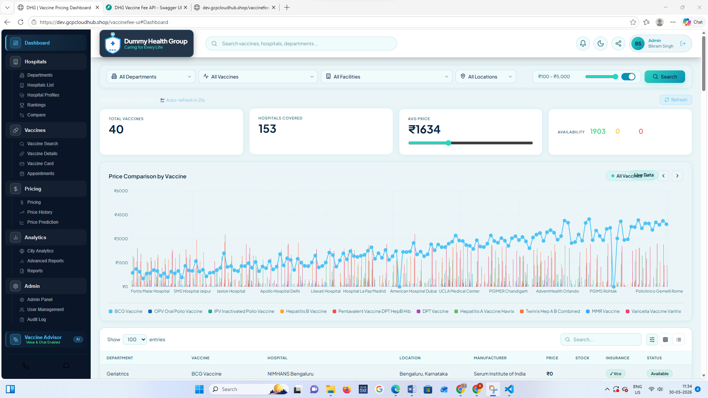

---

### 📱 Login Page
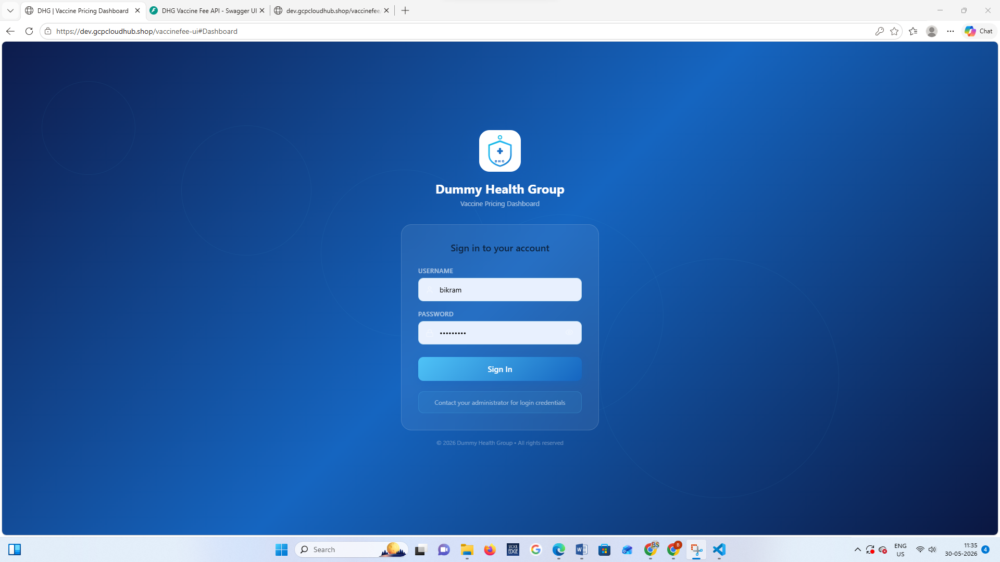

---

## 🛠️ Tech Stack

### 🖥️ Frontend

| Technology | Version | Purpose |
|---|---|---|
| ⚛️ **React** | 18 | Component-based UI framework |
| 📜 **JavaScript** | ES2022 | Primary language (92.6% of codebase) |
| 🎨 **CSS** | Custom Design System | Theme, layout, animations (7% of codebase) |
| 📊 **Recharts** | Latest | Bar, line, pie, radar, area charts |
| 🎨 **Lucide React** | 0.383.0 | Icon library — 200+ icons across all pages |
| 🌐 **Web Speech API** | Browser native | Voice recognition + text-to-speech (`en-IN`) |
| 📦 **react-scripts** | Latest | CRA build tooling, dev server, Jest |

### 🚀 Infrastructure & Deployment

| Technology | Version | Purpose |
|---|---|---|
| 🌐 **nginx** | 1.25-alpine | Serves React build, proxies API, port 8080 |
| 🐳 **Docker** | Multi-stage | `node:20-alpine` builder → `nginx:1.25-alpine` runtime |
| ☸️ **GKE Autopilot** | Latest stable | Production Kubernetes deployment target |
| 📦 **GAR** | — | Google Artifact Registry — Docker image storage |
| 🔄 **GitHub Actions** | — | CI/CD: lint → build → push → deploy |
| 🔐 **WIF** | — | Workload Identity Federation — no JSON keys |

### 🔌 Backend Integration

| Technology | Purpose |
|---|---|
| 🐍 **FastAPI (Python)** | REST API backend — vaccines, hospitals, pricing, auth |
| 🔐 **JWT HS256** | 8-hour access tokens for session management |
| 🐘 **PostgreSQL** | Cloud SQL via PSC at `10.10.0.3:5432` |
| 🤖 **Claude Sonnet API** | Powers the AI Vaccine Advisor |

---

## 📱 All 20 Pages

### 🏠 MAIN

<details open>
<summary><strong>Dashboard</strong> — Command centre of the entire platform</summary>

- **Live KPI Cards** — Total Vaccines, Hospitals Covered, Avg Price, Availability (auto-refresh 30s)
- **Filter Bar** — Department, Vaccine, Hospital, Location, Max Price slider, Insurance toggle
- **Price Chart** — Recharts line chart with 10-month historical data, toggle between vaccine types
- **Data Table** — Paginated (10/25/50/100 per page), search, sort, status badges, insurance badges
- **Export** — CSV, Excel, Print
- **Low Stock Alerts** — ⚠️ warning badge on bell icon with dismiss functionality

</details>

---

### 🏥 HOSPITALS — 5 Pages

<details>
<summary><strong>Departments</strong> — 13 medical department cards</summary>

- 13 department cards (Infectious Diseases, Pediatrics, Cardiology, Oncology, etc.)
- Each card shows: icon, name, description, pricing record count, avg price
- Theme-aware cards (dark/light)

</details>

<details>
<summary><strong>Hospitals List</strong> — Full directory of ~150 hospitals</summary>

- Sortable table with all hospitals — India, USA, Europe, Asia
- Columns: #, Hospital Name, City, Location, Vaccines offered, Avg Price
- Inline search, pagination
- Click row → navigates to Hospital Profile

</details>

<details>
<summary><strong>Hospital Profiles</strong> — Click-through hospital detail page</summary>

- Full hospital details — name, address, location
- Bar chart — top vaccines by availability
- Pie chart — stock status distribution
- Complete vaccine pricing table for that hospital
- CSV export of all pricing for that hospital
- Stats: Avg Price, Min Price, Max Price, Total Vaccines

</details>

<details>
<summary><strong>Rankings</strong> — Score-based hospital ranking</summary>

- Scoring algorithm: availability % + price score + insurance coverage + stock levels
- Podium display for top 3 hospitals
- Full ranked table with score breakdown
- Filter by location/country

</details>

<details>
<summary><strong>Compare</strong> — Side-by-side hospital comparison</summary>

- Select up to 4 hospitals to compare simultaneously
- Radar chart — multi-dimensional performance view
- Metric table — price, vaccines, stock, insurance, location
- Color-coded columns per hospital

</details>

---

### 💉 VACCINES — 4 Pages

<details>
<summary><strong>Vaccine Search</strong> — Filter-based vaccine discovery</summary>

- Filter by: age group, disease category, max price (slider), availability status
- Results grid with manufacturer, price range, hospital count
- Click vaccine → Vaccine Details

</details>

<details>
<summary><strong>Vaccine Details</strong> — Clinical information page</summary>

- Manufacturer, description, dosage schedule
- Which hospitals offer it and at what price
- Side-by-side price comparison across hospitals
- Insurance coverage status per hospital

</details>

<details>
<summary><strong>Vaccine Card</strong> — Digital vaccination record</summary>

- Fill patient name, age, ID number
- Select vaccines received with dates
- Professional printable card layout
- Print button for physical copy

</details>

<details>
<summary><strong>Appointments</strong> — 5-step booking wizard</summary>

**Step 1:** Select vaccine &nbsp;→&nbsp; **Step 2:** Choose hospital &nbsp;→&nbsp; **Step 3:** Pick date & time &nbsp;→&nbsp; **Step 4:** Enter patient info &nbsp;→&nbsp; **Step 5:** Confirm + print slip

</details>

---

### 💰 PRICING — 3 Pages

<details>
<summary><strong>Pricing</strong> — Master pricing table</summary>

- All 5,000+ pricing records with filters
- Filter by: hospital, vaccine, department, status, insurance
- Status badges: 🟢 Available, 🟡 Low Stock, 🔴 Out of Stock
- Insurance badges: ✅ Yes, ❌ No, 🔵 Vco
- CSV/Print export

</details>

<details>
<summary><strong>Price History</strong> — 10-month trend analysis</summary>

- Recharts area/line chart — historical price trends
- Compare up to 5 vaccines simultaneously
- Stats cards: Min, Max, Avg price
- Filter by hospital or vaccine

</details>

<details>
<summary><strong>Price Prediction</strong> — ML 3-month forecast</summary>

- Linear regression model (JavaScript, client-side)
- Confidence interval shading on chart
- 3-month forward projection
- Filter by vaccine to see individual forecasts

</details>

---

### 📊 ANALYTICS — 3 Pages

<details>
<summary><strong>City Analytics</strong> — Geographic comparison</summary>

- Compare Delhi vs Mumbai vs Bengaluru
- Bar chart — avg price per city
- Radar chart — multi-metric city performance
- Rankings table — most affordable city per vaccine

</details>

<details>
<summary><strong>Advanced Reports</strong> — Report generation hub</summary>

- KPI summary with export
- Top vaccines by pricing count bar chart
- Availability distribution pie chart
- PDF export button (browser print-to-PDF)
- Email report UI (compose and send)

</details>

<details>
<summary><strong>Reports</strong> — Summary analytics dashboard</summary>

- Vaccine distribution chart
- Hospital coverage map stats
- Price trend summary
- Department breakdown

</details>

---

### 🔧 ADMIN — 3 Pages

<details>
<summary><strong>Admin Panel</strong> — Full CRUD interface (Admin only)</summary>

- Manage: Vaccines, Hospitals, Departments, Pricing
- Add / Edit / Delete via UI — no Cloud Shell needed
- Inline forms with validation
- Instant list refresh after changes

</details>

<details>
<summary><strong>User Management</strong> — User CRUD (Admin only)</summary>

- Add new users with username, full name, password, role
- Assign: Admin or Viewer role
- Delete users
- No SQL or kubectl required

</details>

<details>
<summary><strong>Audit Log</strong> — Complete action history</summary>

- Tracks: LOGIN, CREATE, UPDATE, DELETE, VIEW
- Columns: Action, Resource, User, Timestamp
- Colour-coded action badges (green=create, red=delete, blue=update)
- Search + filter + CSV export

</details>

---

### ✨ AI — 1 Page

<details open>
<summary><strong>Vaccine Advisor</strong> — AI-powered consultation (Claude Sonnet)</summary>

- 🤖 Powered by **Claude Sonnet** via Anthropic API
- 🎤 **Voice input** — Web Speech API, `en-IN` locale (Indian English)
- 🔊 **Text-to-speech** — toggle speaker, reads AI responses aloud
- 💬 Full conversation context maintained per session
- 🔄 New chat / clear conversation button
- 💡 6 suggested starter questions
- 📊 Knows all 40 vaccines, prices, and ~150 hospitals

</details>

---

## 📁 Project Structure

```
dhg-rateauto-ui-frontend/
│
├── 📁 .github/
│   └── 📁 workflows/
│       ├── 📄 ci.yml              # Main: lint → build → Docker push → GKE deploy
│       └── 📄 gke-deploy.yml     # Reusable deploy workflow (used by ci.yml)
│
├── 📁 Docker/
│   └── 📄 Dockerfile             # Multi-stage: node:20-alpine → nginx:1.25-alpine
│
├── 📁 k8s/
│   ├── 📄 deployment.yaml        # K8s Deployment — rolling update, resource limits
│   ├── 📄 service.yaml           # ClusterIP Service — port 8080
│   ├── 📄 hpa.yaml               # Horizontal Pod Autoscaler
│   └── 📄 serviceaccount.yaml    # K8s ServiceAccount for Workload Identity
│
├── 📁 docs/
│   └── 📁 gallery/               # UI gallery images (add your screenshots here)
│       ├── dashboard-dark.png
│       ├── dashboard-light.png
│       ├── hospitals-list.png
│       └── ...
│
├── 📁 dhg-vaccinefee-ui/         # React application root
│   ├── 📄 package.json           # Dependencies + scripts + proxy config
│   ├── 📄 .eslintrc.js           # ESLint rules (warnings = build errors in CI)
│   │
│   └── 📁 src/
│       ├── 📄 theme.js           # ⭐ Central dark/light color system (all 20 pages use this)
│       ├── 📄 index.css          # Design system — tokens, layout, components (966 lines)
│       ├── 📄 App.js             # Root component
│       │
│       ├── 📁 services/
│       │   └── 📄 api.js         # API calls — public + JWT-protected + paginated fetch
│       │
│       ├── 📁 pages/
│       │   ├── 📄 Dashboard.jsx  # Main orchestrator — auth gate, routes all 20 pages
│       │   ├── 📄 LoginPage.jsx  # Branded JWT login form
│       │   └── 📄 AdminPanel.jsx # Full CRUD admin UI
│       │
│       └── 📁 components/        # 20 page components + 6 shared components
│           │
│           ├── 📄 Header.jsx              # Logo · Global search · Bell alerts · Dark mode toggle
│           ├── 📄 Sidebar.jsx             # Grouped navigation — 6 groups, always-visible sub-items
│           ├── 📄 Filters.jsx             # Dashboard filter bar
│           ├── 📄 StatsCards.jsx          # Live KPI cards — auto-refresh 30s countdown
│           ├── 📄 PriceChart.jsx          # Recharts price trend chart
│           ├── 📄 DataTable.jsx           # Paginated table — search, sort, export
│           │
│           ├── 📄 DepartmentsPage.jsx
│           ├── 📄 HospitalsPage.jsx
│           ├── 📄 HospitalProfilePage.jsx
│           ├── 📄 HospitalRankingPage.jsx
│           ├── 📄 CompareHospitalsPage.jsx
│           │
│           ├── 📄 VaccineSearchPage.jsx
│           ├── 📄 VaccineDetailPage.jsx
│           ├── 📄 VaccineCardPage.jsx
│           ├── 📄 AppointmentPage.jsx
│           │
│           ├── 📄 PricingPage.jsx
│           ├── 📄 PriceHistoryPage.jsx
│           ├── 📄 PricePredictionPage.jsx
│           │
│           ├── 📄 CityAnalyticsPage.jsx
│           ├── 📄 AdvancedReportsPage.jsx
│           ├── 📄 ReportsPage.jsx
│           │
│           ├── 📄 UserManagementPage.jsx
│           ├── 📄 AuditLogPage.jsx
│           │
│           └── 📄 AIVaccineAdvisor.jsx    # Claude + Voice + TTS
│
├── 📄 package-lock.json
└── 📄 README.md                   # This file
```

---

## 🎨 Theme System

The entire dashboard uses a **centralised theme helper** — `src/theme.js` — which every component imports. Toggling `darkMode` instantly re-renders the entire UI with the correct colors.

```javascript
// src/theme.js
export const theme = (dark = true) => ({
  // ── Backgrounds ──────────────────────────────────
  page:       dark ? "#0A1628"                : "#EBF5F7",  // Page background
  card:       dark ? "#0D1F35"                : "#FFFFFF",  // Card surface
  cardAlt:    dark ? "#0F2440"                : "#F0FBFC",  // Alternate surface
  input:      dark ? "rgba(255,255,255,0.08)" : "#F0FBFC",  // Input fields
  hover:      dark ? "rgba(255,255,255,0.04)" : "rgba(8,145,178,0.05)",
  tableHead:  dark ? "rgba(255,255,255,0.05)" : "#EBF8FA",

  // ── Text ─────────────────────────────────────────
  text:       dark ? "rgba(255,255,255,0.88)" : "#0C2340",  // Primary
  textSec:    dark ? "rgba(255,255,255,0.55)" : "#2E6B7A",  // Secondary
  textMuted:  dark ? "rgba(255,255,255,0.35)" : "#6B9EAA",  // Muted

  // ── Borders ──────────────────────────────────────
  border:     dark ? "rgba(255,255,255,0.08)" : "rgba(8,145,178,0.12)",
  borderMid:  dark ? "rgba(255,255,255,0.12)" : "rgba(8,145,178,0.2)",

  // ── Accents (same in both modes) ─────────────────
  teal:       "#2DD4BF",
  tealMid:    "#0891B2",
  tealBg:     dark ? "rgba(45,212,191,0.1)"  : "rgba(8,145,178,0.08)",
  green:      "#34D399",
  red:        "#F87171",
  amber:      "#FCD34D",
  price:      dark ? "#2DD4BF"               : "#0891B2",
});
```

**Usage in every component:**
```javascript
import { theme } from "../theme";

export default function MyPage({ darkMode = true }) {
  const t = theme(darkMode);

  return (
    <div style={{ background: t.page, color: t.text }}>
      <div style={{ background: t.card, border: `1px solid ${t.border}` }}>
        <span style={{ color: t.textSec }}>Avg Price</span>
        <span style={{ color: t.teal }}>₹1,786</span>
      </div>
    </div>
  );
}
```

### Deep Ocean Teal Design Tokens

| Token | Dark Mode | Light Mode |
|---|---|---|
| **Page Background** | `#0A1628` | `#EBF5F7` |
| **Sidebar** | `#091422` | `#091422` (always dark) |
| **Cards** | `#0D1F35` | `#FFFFFF` |
| **Accent (Teal)** | `#2DD4BF` | `#2DD4BF` |
| **Primary Text** | `rgba(255,255,255,0.88)` | `#0C2340` |
| **Secondary Text** | `rgba(255,255,255,0.55)` | `#2E6B7A` |
| **Borders** | `rgba(255,255,255,0.08)` | `rgba(8,145,178,0.12)` |
| **CSS Transition** | 0.3s ease | 0.3s ease |

---

## 🔐 Authentication & RBAC

### JWT Login Flow

```
LoginPage.jsx  ──POST /vaccinefee/api/auth/login──▶  FastAPI
                                                          │
                                          Verifies bcrypt hash in PostgreSQL
                                                          │
                                        Returns JWT (HS256, 8hr expiry, role claim)
                                                          │
Dashboard.jsx  ◀──────── { token, username, role } ──────┘
      │
      ▼
localStorage.setItem("dhg_jwt_token", token)
      │
      ▼ On every page load:
const payload = JSON.parse(atob(token.split(".")[1]));
if (payload.exp * 1000 < Date.now()) → redirect to LoginPage
      │
      ▼ On every API call:
headers: { "Authorization": `Bearer ${token}` }
```

### Default Users

| Role | Username | Password | Can Do |
|---|---|---|---|
| 👑 **Admin** | `bikram` | `Admin@123` | Read + Write + Delete all data |
| 👁️ **Viewer** | `viewer` | `View@123` | Read-only — write buttons hidden |

### RBAC in UI

```jsx
// Write actions only visible to Admin
{currentUser?.role === "Admin" && (
  <button onClick={handleAddHospital}>+ Add Hospital</button>
)}

// All users can view data
<DataTable data={hospitals} />
```

---

## 🔍 Global Search

The Header search bar is a **unified search across 4 entity types**:

```
Type 2+ characters → dropdown appears instantly

┌────────────────────────────────────────────────────────┐
│  🗂️  PAGES (up to 4)                                    │
│  ┌─────────────────────────────────────────────────┐   │
│  │ 🪪  Vaccine Card          Print vaccination record│   │
│  │ 📅  Appointments          Book vaccination...     │   │
│  └─────────────────────────────────────────────────┘   │
│                                                         │
│  💉  VACCINES (up to 4)                                 │
│  ┌─────────────────────────────────────────────────┐   │
│  │ Covishield (ChAdOx1)  Serum Inst.  108 hospitals │   │
│  └─────────────────────────────────────────────────┘   │
│                                                         │
│  🏥  HOSPITALS (up to 4)                                │
│  ┌─────────────────────────────────────────────────┐   │
│  │ Apollo Hospital Delhi  New Delhi  avg ₹1,450    │   │
│  └─────────────────────────────────────────────────┘   │
│                                                         │
│  🏢  DEPARTMENTS (up to 3)                              │
│  ┌─────────────────────────────────────────────────┐   │
│  │ Cardiology                      Heart dept      │   │
│  └─────────────────────────────────────────────────┘   │
└────────────────────────────────────────────────────────┘
```

- Click **any page result** → navigates directly to that page
- Click **any vaccine** → navigates to Vaccine Search
- Click **any hospital** → navigates to Hospital Profiles
- Press **Esc or click outside** → closes dropdown
- **X button** → clears search and closes

---

## 🤖 AI Vaccine Advisor

### System Architecture

```
User types or speaks question
        │
        ▼
Web Speech API (SpeechRecognition, lang="en-IN")
→ Transcribes to text
        │
        ▼
AIVaccineAdvisor.jsx builds context-aware system prompt:
  ┌─────────────────────────────────────────────┐
  │ System: You are DHG's vaccine advisor...    │
  │ Data: 40 vaccines with prices + hospitals   │
  │ Hospitals: ~150 names, locations, pricing   │
  └─────────────────────────────────────────────┘
        │
        ▼
POST /vaccinefee/api/ai/chat
        │
        ▼
FastAPI → Anthropic API
  model: claude-sonnet-4-20250514
  max_tokens: 1000
        │
        ▼
AI response rendered in chat bubble
        │
        ▼
SpeechSynthesis (if speaker enabled)
  lang: "en-IN", rate: 0.9, pitch: 1.0
```

### Advisor Features

| Feature | Details |
|---|---|
| 🎤 **Voice Input** | Click mic → speak → auto-transcribes |
| 🔊 **Text-to-Speech** | Toggle speaker to hear response in Indian English |
| 💬 **Conversation memory** | Full session history sent with each message |
| 🔄 **New Chat** | Clear history and restart conversation |
| 💡 **Suggested Questions** | 6 pre-built starters shown on load |
| 📊 **Data-aware** | AI knows real prices, hospitals, vaccine schedules |

---

## 🌐 API Integration

### `src/services/api.js`

```javascript
const API_BASE = "/vaccinefee/api";

// ── Public endpoints (no auth header) ─────────────────────
export const fetchVaccines    = () => fetchJSON(`${API_BASE}/vaccines/?limit=200`);
export const fetchHospitals   = () => fetchJSON(`${API_BASE}/hospitals/?limit=500`);
export const fetchDepartments = () => fetchJSON(`${API_BASE}/departments/`);

// ── Protected endpoints (JWT required) ────────────────────
export const fetchPricingBatch = (skip, token) =>
  fetchJSONAuth(`${API_BASE}/pricing/?limit=500&skip=${skip}`, token);

// ── Paginated fetch — solves 504 timeout on 5,000+ records ─
export const fetchAllPricing = async (token) => {
  let all = [], skip = 0;
  while (true) {
    const batch = await fetchPricingBatch(skip, token);
    if (!batch.length) break;
    all = [...all, ...batch];
    if (batch.length < 500) break;  // Last page
    skip += 500;
  }
  return all;  // Full 5,000+ records
};
```

The **500-per-batch pagination** is critical — fetching all 5,000+ pricing records in one request causes a 504 Gateway Timeout. Batching in groups of 500 solves this completely.

---

## 🖥️ Local Development

### Prerequisites

```bash
# Check versions
node --version   # Requires >= 18
npm --version    # Requires >= 9
```

### Quick Start

```bash
# 1. Clone the repository
git clone https://github.com/bikram-singh/dhg-rateauto-ui-frontend.git
cd dhg-rateauto-ui-frontend/dhg-vaccinefee-ui

# 2. Install all dependencies
npm install

# 3. Start development server (hot reload enabled)
npm start
# → Opens http://localhost:3000/vaccinefee-ui automatically
# → API calls proxied to http://localhost:8000

# 4. Build production bundle
npm run build
# → Outputs to dhg-vaccinefee-ui/build/

# 5. Run linter
npm run lint
# → Must pass with zero errors before committing
```

### npm Scripts

| Script | Command | Description |
|---|---|---|
| 🚀 **Start** | `npm start` | Dev server port 3000, hot reload, API proxy |
| 🏗️ **Build** | `npm run build` | Production optimised React bundle → `/build` |
| 🔍 **Lint** | `npm run lint` | ESLint — zero tolerance for errors or warnings |
| 🧪 **Test** | `npm test` | Run Jest unit tests |

### Local API Backend

To run with a live backend locally:

```bash
# In a separate terminal — start the FastAPI backend
cd dhg-rateauto-api-backend/dhg-vaccinefee-api
uvicorn app.main:app --reload --port 8000

# The React dev server proxies /vaccinefee/api/* to localhost:8000
# Configured in package.json: "proxy": "http://localhost:8000"
```

---

## 🐳 Docker

### Multi-Stage Dockerfile

```dockerfile
# ── Stage 1: Build the React app ───────────────────────────────
FROM node:20-alpine AS builder

WORKDIR /app
COPY dhg-vaccinefee-ui/package*.json ./
RUN npm ci                            # Clean install from lockfile
COPY dhg-vaccinefee-ui/ .
RUN npm run build                     # Outputs to /app/build

# ── Stage 2: Serve with nginx ──────────────────────────────────
FROM nginx:1.25-alpine

# Copy built React app
COPY --from=builder /app/build /usr/share/nginx/html

# Copy nginx config (routes, proxy, gzip, headers)
COPY Docker/nginx.conf /etc/nginx/conf.d/default.conf

EXPOSE 8080
CMD ["nginx", "-g", "daemon off;"]
```

**Why multi-stage?**
- Final image contains **only nginx + static files** — no Node.js, no npm, no source code
- Image size: ~50MB (vs ~700MB if Node was included)
- No build tools in production image = smaller attack surface

### Build & Run Locally

```bash
# Build image
docker build \
  -f Docker/Dockerfile \
  -t dhg-vaccinefee-ui:local \
  .

# Run container
docker run -p 8080:8080 dhg-vaccinefee-ui:local

# Test it
curl http://localhost:8080/vaccinefee-ui
```

### nginx Configuration

```nginx
server {
    listen 8080;
    root /usr/share/nginx/html;
    index index.html;

    # React SPA — all routes serve index.html
    location /vaccinefee-ui {
        try_files $uri $uri/ /index.html;
    }

    # Gzip for performance
    gzip on;
    gzip_types text/css application/javascript application/json;

    # Security headers
    add_header X-Frame-Options DENY;
    add_header X-Content-Type-Options nosniff;
    add_header X-XSS-Protection "1; mode=block";
}
```

---

## ☸️ Kubernetes

### `k8s/deployment.yaml`

```yaml
apiVersion: apps/v1
kind: Deployment
metadata:
  name: dhg-vaccinefee-ui
  namespace: dhg-rateauto-dev-namespace
spec:
  replicas: 2
  selector:
    matchLabels:
      app: dhg-vaccinefee-ui

  strategy:
    type: RollingUpdate
    rollingUpdate:
      maxSurge: 1          # One extra pod during deploy
      maxUnavailable: 0    # Never drop below 2 — zero downtime

  progressDeadlineSeconds: 900  # 15-minute deploy timeout

  template:
    spec:
      containers:
        - name: dhg-vaccinefee-ui
          image: us-central1-docker.pkg.dev/dhg-vaccine-rateauto-nonpord/dhg-vaccinefee-repo/dhg-vaccinefee-ui:latest
          ports:
            - containerPort: 8080
          resources:
            requests:
              memory: "128Mi"
              cpu:    "100m"
            limits:
              memory: "256Mi"
              cpu:    "500m"
```

### All K8s Resources

| File | Kind | Purpose |
|---|---|---|
| `deployment.yaml` | `Deployment` | Pod spec, image, rolling update config, resource limits |
| `service.yaml` | `Service` | ClusterIP on port 8080 — routes Gateway traffic to pods |
| `hpa.yaml` | `HorizontalPodAutoscaler` | Auto-scales replicas on CPU/memory threshold |
| `serviceaccount.yaml` | `ServiceAccount` | Identity for Workload Identity binding |

---

## ⚙️ CI/CD Pipeline

### Pipeline Flow (`.github/workflows/ci.yml`)

```
Push to main branch
        │
        ▼
┌──────────────────────────────────────────────────────────────┐
│  Step 1 — Setup                                               │
│  • Checkout code                                             │
│  • Setup Node.js 20                                          │
│  • Authenticate GCP via WIF (no JSON keys!)                  │
│  • Configure kubectl for GKE cluster                         │
└──────────────────────────────────┬───────────────────────────┘
                                   │
                                   ▼
┌──────────────────────────────────────────────────────────────┐
│  Step 2 — Quality Gate                                        │
│  • cd dhg-vaccinefee-ui                                      │
│  • npm install                                               │
│  • npm run lint   ←─ FAIL HERE if any ESLint error/warning   │
│  • npm run build  ←─ FAIL HERE if compilation error          │
└──────────────────────────────────┬───────────────────────────┘
                                   │
                                   ▼
┌──────────────────────────────────────────────────────────────┐
│  Step 3 — Containerise                                        │
│  • docker build -f Docker/Dockerfile -t ${IMAGE}:${SHA} .   │
│  • docker push → GAR (us-central1-docker.pkg.dev/...)       │
└──────────────────────────────────┬───────────────────────────┘
                                   │
                                   ▼
┌──────────────────────────────────────────────────────────────┐
│  Step 4 — Deploy                                              │
│  • kubectl set image deployment/dhg-vaccinefee-ui \         │
│      dhg-vaccinefee-ui=${IMAGE}:${SHA}                       │
│  • kubectl rollout status deployment/dhg-vaccinefee-ui \    │
│      -n dhg-rateauto-dev-namespace                           │
│  • PASS = zero-downtime rolling update complete              │
└──────────────────────────────────────────────────────────────┘
```

### WIF Authentication (No Stored Keys)

```yaml
- name: Authenticate to Google Cloud
  uses: google-github-actions/auth@v2
  with:
    workload_identity_provider: >-
      projects/PROJECT_NUMBER/locations/global/workloadIdentityPools/
      dhg-rateauto-wif-pool/providers/github-oidc
    service_account: >-
      dhg-ui-deploy-sa@dhg-vaccine-rateauto-nonpord.iam.gserviceaccount.com
```

GitHub mints a short-lived OIDC token → Google validates against the WIF pool → issues temporary GCP credentials. The credentials expire the moment the job ends. No secrets to rotate. No credentials to leak.

---

## 📋 ESLint & Code Quality

### Configuration (`.eslintrc.js`)

```javascript
module.exports = {
  extends: ["react-app", "react-app/jest"],
  rules: {
    "no-unused-vars":             "error",   // Unused imports = build failure
    "no-undef":                   "error",   // Undefined vars = build failure
    "react-hooks/exhaustive-deps": "warn",   // Hook deps = build failure in CI
    "no-useless-escape":          "warn",    // Regex escapes = build failure in CI
  }
};
```

### Why Strict?

GitHub Actions sets `process.env.CI = true`. React's build tool then promotes **all ESLint warnings to errors**. This means:
- ⚠️ Unused import → ❌ Build fails
- ⚠️ Missing hook dependency → ❌ Build fails
- ⚠️ Undefined variable → ❌ Build fails

This keeps the codebase clean — you cannot merge broken or sloppy code.

### Key Code Patterns

```javascript
// ✅ Disable hooks rule only when intentional
useEffect(() => {
  loadData();
}, []); // eslint-disable-line react-hooks/exhaustive-deps

// ✅ Avoid && with numbers — React renders 0!
// ❌ Wrong:  {price && `₹${price}`}   → shows "0" when price=0
// ✅ Right:  {price > 0 ? `₹${price}` : ""}

// ✅ Always use theme helper, never hardcode colors
const t = theme(darkMode);
<div style={{ color: t.text, background: t.card }}>
```

---

## 🔧 Environment Variables

No `.env` file is required. The API base path is a constant:

```javascript
// src/services/api.js
const API_BASE = "/vaccinefee/api";
```

All routing from `/vaccinefee/api/*` to the FastAPI backend is handled by the **GKE Gateway API** in production and by the **React dev proxy** locally:

```json
// dhg-vaccinefee-ui/package.json
{
  "proxy": "http://localhost:8000"
}
```

---

## 🔒 Security

| Layer | Implementation |
|---|---|
| 🔐 **Auth** | JWT stored in `localStorage`, auto-redirect on expiry |
| 👥 **RBAC** | Role checked per button/action — Admin vs Viewer |
| 🔒 **HTTPS** | Google-managed SSL cert, TLS 1.2+, HTTP → HTTPS redirect |
| 🛡️ **No secrets in code** | All keys in K8s Secrets, injected as env vars at runtime |
| 🧹 **XSS protection** | React JSX escapes all output by default |
| 🔒 **nginx headers** | `X-Frame-Options: DENY`, `X-Content-Type-Options: nosniff` |
| 🔐 **WIF** | No JSON keys in repo or GitHub Secrets |
| 🐳 **Minimal image** | nginx:1.25-alpine — no Node.js in production image |
| 🔑 **RBAC K8s** | ServiceAccount with least-privilege roles |

---

## 🖼️ Adding Your Own UI Gallery Images

Follow these steps to add your real screenshots to the `docs/gallery/` folder and make the UI Gallery section above display them:

### Step 1 — Create the gallery folder in your repo

```bash
# On Windows (PowerShell)
mkdir docs\gallery

# On Mac/Linux
mkdir -p docs/gallery
```

### Step 2 — Name and place your screenshots

Save your screenshots with these exact names into `docs/gallery/`:

| Filename | Page to capture |
|---|---|
| `dashboard-dark.png` | Dashboard in dark mode |
| `dashboard-light.png` | Dashboard in light mode |
| `hospitals-list.png` | Hospitals List page |
| `hospital-profile.png` | Hospital Profile detail |
| `vaccine-search.png` | Vaccine Search page |
| `pricing.png` | Pricing table |
| `price-history.png` | Price History charts |
| `vaccine-advisor.png` | AI Vaccine Advisor chat |
| `appointments.png` | Appointment booking wizard |
| `city-analytics.png` | City Analytics page |
| `login.png` | Login page |

### Step 3 — Push to GitHub

```bash
git add docs/gallery/
git commit -m "docs: add UI gallery screenshots"
git push
```

### Step 4 — Verify

Open your GitHub repo → navigate to `docs/gallery/` — the images should appear. The UI Gallery section in this README will now show the actual screenshots automatically.

> 💡 **Tip:** For the best results, take screenshots at **1440×900** or higher resolution, and use **PNG format** for crisp UI rendering.

> 💡 **Alternative:** You can also host screenshots on [Imgur](https://imgur.com) or [GitHub Issues](https://github.com/bikram-singh/dhg-rateauto-ui-frontend/issues/new) (drag-drop an image in the editor to get a URL), then use the full URL directly in the markdown image tag.

---

## 🔗 Related Repositories

| Repository | Role | Purpose |
|---|---|---|
| [`dhg-rateauto-ui-frontend`](https://github.com/bikram-singh/dhg-rateauto-ui-frontend) | **This repo** | React 18 Frontend Dashboard |
| [`dhg-rateauto-api-backend`](https://github.com/bikram-singh/dhg-rateauto-api-backend) | App Layer | FastAPI Python Backend |
| [`dhg-rateauto-tf-vpc`](https://github.com/bikram-singh/dhg-rateauto-tf-vpc) | Infrastructure | VPC, Subnet, NAT, Firewall |
| [`dhg-rateauto-tf-gke`](https://github.com/bikram-singh/dhg-rateauto-tf-gke) | Infrastructure | GKE Autopilot Cluster |
| [`dhg-rateauto-tf-gke-routing`](https://github.com/bikram-singh/dhg-rateauto-tf-gke-routing) | Infrastructure | Gateway API, HTTPS, SSL |
| [`dhg-rateauto-tf-postgres`](https://github.com/bikram-singh/dhg-rateauto-tf-postgres) | Infrastructure | Cloud SQL PostgreSQL + PSC |
| [`dhg-rateauto-tf-gcs-buckets`](https://github.com/bikram-singh/dhg-rateauto-tf-gcs-buckets) | Infrastructure | GCS Bucket Provisioning |

---

<div align="center">

**Maintained by Bikram Singh · DHG Platform Engineering**

`dhg-vaccine-rateauto-nonpord` · `us-central1` · React 18 + GKE Autopilot

<br/>

🌐 **Live:** [`https://dev.gcpcloudhub.shop/vaccinefee-ui`](https://dev.gcpcloudhub.shop/vaccinefee-ui) &nbsp;|&nbsp;
📖 **API Docs:** [`https://dev.gcpcloudhub.shop/vaccinefee/api/docs`](https://dev.gcpcloudhub.shop/vaccinefee/api/docs)

</div>
